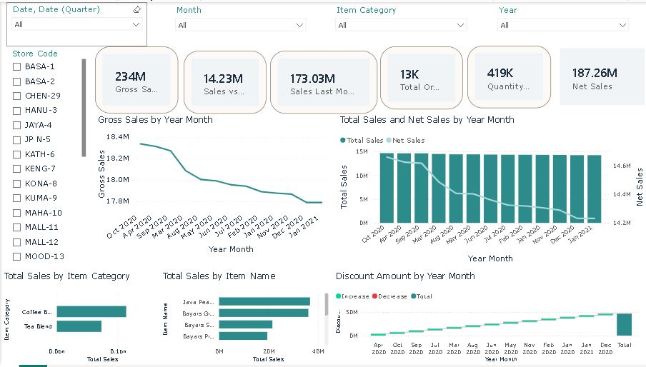

# ☕ Coffee Craft Performance Analytics

## 📊 Power BI Coffee Sales Dashboard

An interactive Power BI dashboard developed to analyze coffee sales performance across different time periods, stores, item categories, and individual items.

The project transforms coffee sales data into meaningful business insights using Power Query, data modeling, DAX measures, KPI cards, slicers, and interactive visualizations.

---

## 🎯 Project Objective

The objective of this project is to transform coffee sales data into an interactive business intelligence dashboard that supports:

- Sales performance monitoring
- Time-based sales trend analysis
- Category comparison
- Item-level sales analysis
- Store-level filtering
- Quantity and order analysis
- Gross Sales and Net Sales comparison

---

## 🛠️ Tools & Technologies

- Microsoft Power BI
- Power Query
- DAX
- Data Modeling
- Data Visualization
- Time Intelligence
- Interactive Slicers
- Cross-Highlighting
- KPI Cards

---

## 📊 Key KPIs

The dashboard includes the following key performance indicators:

- Gross Sales
- Net Sales
- Sales YOY
- Sales Last Month
- Total Orders
- Quantity Sold

---

## 🎛️ Interactive Filters

Users can dynamically filter the dashboard using:

- Year
- Quarter
- Month
- Item Category
- Store Code

Interactive filtering and cross-highlighting allow users to explore sales performance by time period, store, category, and item.

---

## 📈 Dashboard Visualizations

The dashboard contains the following visualizations:

- **Gross Sales by Year Month** — Line chart showing the monthly gross sales trend.
- **Total Sales and Net Sales by Year Month** — Combo chart comparing total sales and net sales across months.
- **Total Sales by Item Category** — Bar chart comparing sales performance across coffee categories.
- **Total Sales by Item Name** — Bar chart showing sales performance by individual coffee items.
- **Discount Amount by Year Month** — Waterfall chart showing the monthly discount amount and its overall impact.
- **KPI Cards** — Displays Gross Sales, Sales YOY, Sales Last Month, Total Orders, Quantity Sold, and Net Sales.

---

## 🖼️ Dashboard Preview

---

## 📁 Project Files

| File | Description |
|---|---|
| `Coffee_Craft_Performance_Analytics.pbix` | Power BI dashboard project |
| `appended data.xlsx` | Source coffee sales dataset |
| `Coffee_Craft_Performance_Analytics.JPG` | Dashboard preview image |

---

## 🔍 Key Analysis Areas

### Sales Performance
Analysis of Gross Sales, Net Sales, Total Orders, Quantity Sold, Sales YOY, and Sales Last Month.

### Time-Based Analysis
Analysis of sales trends across Year, Quarter, Month, and Year Month.

### Category Analysis
Comparison of sales performance across different coffee item categories.

### Item-Level Analysis
Analysis and comparison of sales performance across individual coffee items.

### Store Analysis
Store Code filtering enables users to analyze sales performance for individual stores.

### Discount Analysis
Monthly Discount Amount analysis helps understand the impact of discounts on sales.

---

## 🚀 Future Enhancements

- SQL database integration
- Automated data refresh
- Drill-through pages
- Sales forecasting
- Sales target tracking
- Row-level security
- Mobile-optimized Power BI report
- KPI alerts and performance indicators
- Microsoft Fabric integration

---

## 👨‍💻 Author

Chaganti Rohith Kumar Reddy

Data Analytics | Power BI

🔗 **GitHub:** [Crohith123](https://github.com/Crohith123)

🔗 **Project Repository:** [Coffee Craft Performance Analytics](https://github.com/Crohith123/coffee-craft-performance-analytics)

---

## 📚 Project Type

**Data Analytics | Business Intelligence | Power BI**

---

⭐ If you find this project useful, feel free to explore the repository.
